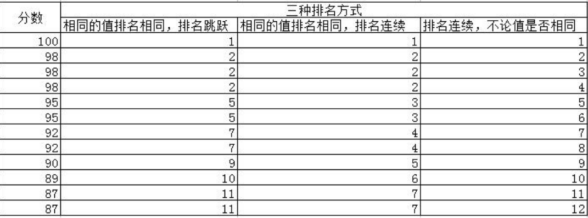
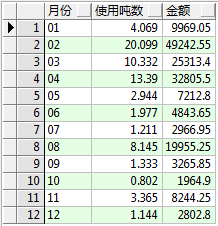

# 目录

[TOC]

# 开始创建

## 创建表空间

创建一个名为"waterboss"的表空间，使用名为"c:\waterboss.dbf"的数据文件，初始大小为100MB，并且开启自动扩展功能，每次扩展10MB。

```mysql
create tablespace waterboss
datafile 'c:\waterboss.dbf'
size 100m
autoextend on 
next 10m;
```

## 创建用户

创建一个名为"wateruser"的用户，并设置其密码为"itcast"，默认表空间为"waterboss"。

```mysql
create user wateruser
identified by itcast
default tablespace waterboss;
```

## 授予权限

为用户"wateruser"授予DBA权限。

> 请注意，授予DBA权限是一个非常高级别的权限，它允许用户对数据库进行几乎所有的操作。在授予DBA权限之前，请确保对用户进行了仔细的审核，并确保用户具有足够的信任和责任感。
>

```mysql
grant dba to wateruser
```

## 创建表

这段代码是创建了一个名为"T_OWNERS"的表，表中包含了以下列：
```mysql
CREATE TABLE T_OWNERS(
ID NUMBER PRIMARY KEY,
NAME VARCHAR2(30),
ADDRESSID NUMBER,
HOUSENUMBER VARCHAR2(30),
WATERMETER VARCHAR2(30),
ADDDATE DATE,
OWNERTYPEID NUMBER
)
```

## 修改表

:white_square_button:增加字段语法：

```mysql
----追加字段
ALTER TABLE T_OWNERS ADD(
REMARK VARCHAR2(20),
OUTDATE DATE
)
```


:white_square_button: 修改字段语法：

```mysql
ALTER TABLE T_OWNERS MODIFY(
REMARK CHAR(20),
OUTDATE TIMESTAMP
)
```


:white_square_button:修改字段名语法：

```mysql
ALTER TABLE T_OWNERS RENAME COLUMN OUTDATE TO EXITDATE
```


:white_square_button:删除字段名：

```mysql
--删除一个字段
ALTER TABLE 表名称 DROP COLUMN 列名
--删除多个字段
ALTER TABLE 表名称 DROP (列名 1,列名 2...)

-- 举例：
ALTER TABLE T_OWNERS DROP COLUMN REMARK
```
> ALTER	 （使）改变，更改;
>MODIFY	修改，改进；
> DROP	    落下;剔除，除名;下降


## 删除表

```mysql
DROP TABLE 表名称
```


# 数据增删改

## 插入数据

```mysql
insert into T_OWNERTYPE (ID,NAME) VALUES (1,'居民');
insert into T_OWNERS VALUES (1,'张三丰',1,'1-1','123456',sysdate,1 );
commit;
-- sysdate 用于获取当前日期

-- 笔记：
insert int table_name (column1,column2,column3)
values (v1,v2,v3),(v4,v5,v6).......
```

执行 INSERT 后一定要再执行 commit 提交事务


##  修改数据

```mysql
-- 将 ID 为 1 的业主的登记日期更改为三天前的日期
update T_OWNERS set adddate=adddate-3 where id=1;
commit;

-- 笔记
update table_name 
set column1=v1,clolumn2=v2,column3=v3.......
from table_name
where xxx
```

> SET	设置  ; 使处于 ; 放 ; 置 ；


## 删除数据

📶**delete 删除**

```mysql
-- 用于删除名为 T_OWNERS 的表中 id 为 1 的记录，并将更改提交到数据库。
delete from T_OWNERS where id=1;
commit;

-- 笔记 清空整张表的内容
delete from tabale_name;
-- 删除指定的条数 
delete from table_name
where  xxx;
```


📶**truncate删除**

```mysql
-- 删除语句
-- 用于删除表中的所有数据，但不删除表的结构。
-- 此操作是不可逆的，所以在执行之前请务必谨慎确认。
truncate table T_OWNERTYPE
```

比较 truncat 与 delete 实现数据删除？

1. delete 删除的数据可以 rollback
2. delete 删除可能产生碎片，并且不释放空间
3. truncate 是先摧毁表结构，再重构表结构

> truncate	截断，删节；


# 数据导出与导入

```mysql
exp(imp)  username/password@SERVICENAME:1521 file="e:\temp.dmp" full = y;
```

Oracle备份文件是以dmp结尾，这种文件是oracle的逻辑备份文件，常用于数据库逻辑备份，数据库迁移等操作。


## 按库

:white_square_button:**整库导出命令**

```mysql
exp system/itcast full=y
```

执行命令后会在当前目录下生成一个叫 EXPDAT.DMP，此文件为备份文件。

 

如果想指定备份文件的名称，则添加 file 参数即可，命令如下

```mysql
exp system/itcast  full=y file=文件名
```


:white_square_button:**整库导入命令**

```mysql
imp system/itcast full=y
```

此命令如果不指定 file 参数，则默认用备份文件 EXPDAT.DMP 进行导入


如果指定 file 参数，则按照 file 指定的备份文件进行恢复

```mysql
imp system/itcast full=y file=water.dmp
```

> EXPDAT	输出文件


## 按用户

:arrow_forward:**按用户导出与导入**

```mysql
exp system/itcast owner=wateruser file=wateruser.dmp
```


:arrow_forward:**按用户导入**

```mysql
imp system/itcast file=wateruser.dmp fromuser=wateruser
```


## 按表

:black_square_button:**按表导出**

```mysql
exp wateruser/itcast file=a.dmp tables=t_account,a_area
```

用 tables 参数指定需要导出的表，如果有多个表用逗号分割即可


:black_square_button:**按表导入**

```mysql
imp wateruser/itcast file=a.dmp tables=t_account,a_area
```

按需求导入，不需要都导入。

> owner		n.物主；所有权人；主人


#  :fire:项目案例：《自来水公司收费系统》

> :fire::fire::fire:先看题目，遇到不会的再看哪部分知识不会
>
> 项目只是更好的理解代码，而不是真正创建。对于细节，我是是初学者，不要过意不去这个部分不会，继续学语法。


XXX 市自来水公司为更好地对自来水收费进行规范化管理，决定委托传智播客.黑马程序员开发《自来水公司收费系统》。考虑到自来水业务数量庞大，数据并发量高，决定数据库采用 ORACLE 数据库。


## 🎃表结构设计

 

 

 

owneruuid number, 业主编号


## 🎃数库模型

 


## 💡代码（直接复制粘贴运行）

> 先看后面的查询，先不要看代码

```mysql
--建立价格区间表
create  table t_pricetable
(
id number primary key,	
price number(10,2),   	
ownertypeid number,
minnum number,
maxnum number
);


--业主类型
create table t_ownertype
(
id number primary key,
name varchar2(30)
);

--业主表
create table t_owners
(
id number primary key,
name varchar2(30),
addressid number,
housenumber varchar2(30),
watermeter varchar2(30),
adddate date,
ownertypeid number
);


--区域表
create table t_area
(
id number,
name varchar2(30)
);

--收费员表
create table t_operator
(
id number,
name varchar2(30)
);


--地址表
create table t_address
(
id number primary key,
name varchar2(100),
areaid number,
operatorid number
);


--账务表--
create table t_account 
(
id number primary key,
owneruuid number,
ownertype number,
areaid number,
year char(4),
month char(2),
num0 number,
num1 number,
usenum number,
meteruser number,
meterdate date,
money number(10,2),
isfee char(1),
feedate date,
feeuser number
);


create sequence seq_account;

--业主类型
insert into t_ownertype values(1,'居民');
insert into t_ownertype values(2,'行政事业单位');
insert into t_ownertype values(3,'商业');

--地址信息--
insert into t_address values( 1,'明兴花园',1,1);
insert into t_address values( 2,'鑫源秋墅',1,1);
insert into t_address values( 3,'华龙苑南里小区',2,2);
insert into t_address values( 4,'河畔花园',2,2);
insert into t_address values( 5,'霍营',2,2);
insert into t_address values( 6,'回龙观东大街',3,2);
insert into t_address values( 7,'西二旗',3,2);

--业主信息
insert into t_owners values(1,'范冰',1,'1-1','30406',to_date('2015-04-12','yyyy-MM-dd'),1 );
insert into t_owners values(2,'王强',1,'1-2','30407',to_date('2015-02-14','yyyy-MM-dd'),1 );
insert into t_owners values(3,'马腾',1,'1-3','30408',to_date('2015-03-18','yyyy-MM-dd'),1 );
insert into t_owners values(4,'林小玲',2,'2-4','30409',to_date('2015-06-15','yyyy-MM-dd'),1 );
insert into t_owners values(5,'刘华',2,'2-5','30410',to_date('2013-09-11','yyyy-MM-dd'),1 );
insert into t_owners values(6,'刘东',2,'2-2','30411',to_date('2014-09-11','yyyy-MM-dd'),1 );
insert into t_owners values(7,'周健',3,'2-5','30433',to_date('2016-09-11','yyyy-MM-dd'),1 );
insert into t_owners values(8,'张哲',4,'2-2','30455',to_date('2016-09-11','yyyy-MM-dd'),1 );
insert into t_owners values(9,'昌平区中西医结合医院',5,'2-2','30422',to_date('2016-10-11','yyyy-MM-dd'),2 );
insert into t_owners values(10,'美廉美超市',5,'4-2','30423',to_date('2016-10-12','yyyy-MM-dd'),3 );


--操作员
insert into t_operator values(1,'马小云');
insert into t_operator values(2,'李翠花');


--地区--
insert into t_area values(1,'海淀');
insert into t_area values(2,'昌平');
insert into t_area values(3,'西城');
insert into t_area values(4,'东城');
insert into t_area values(5,'朝阳');
insert into t_area values(6,'玄武');


--价格表--

insert into t_pricetable values(1,2.45,1,0,5);
insert into t_pricetable values(2,3.45,1,5,10);
insert into t_pricetable values(3,4.45,1,10,null);

insert into t_pricetable values(4,3.87,2,0,5);
insert into t_pricetable values(5,4.87,2,5,10);
insert into t_pricetable values(6,5.87,2,10,null);

insert into t_pricetable values(7,4.36,3,0,5);
insert into t_pricetable values(8,5.36,3,5,10);
insert into t_pricetable values(9,6.36,3,10,null);

--账务表--
insert into t_account values( seq_account.nextval,1,1,1,'2012','01',30203,50123,0,1,sysdate,34.51,'1',to_date('2012-02-14','yyyy-MM-dd'),2 );
insert into t_account values( seq_account.nextval,1,1,1,'2012','02',50123,60303,0,1,sysdate,23.43,'1',to_date('2012-03-14','yyyy-MM-dd'),2 );
insert into t_account values( seq_account.nextval,1,1,1,'2012','03',60303,74111,0,1,sysdate,45.34,'1',to_date('2012-04-14','yyyy-MM-dd'),2 );
insert into t_account values( seq_account.nextval,1,1,1,'2012','04',74111,77012,0,1,sysdate,52.54,'1',to_date('2012-05-14','yyyy-MM-dd'),2 );
insert into t_account values( seq_account.nextval,1,1,1,'2012','05',77012,79031,0,1,sysdate,54.66,'1',to_date('2012-06-14','yyyy-MM-dd'),2 );
insert into t_account values( seq_account.nextval,1,1,1,'2012','06',79031,80201,0,1,sysdate,76.45,'1',to_date('2012-07-14','yyyy-MM-dd'),2 );
insert into t_account values( seq_account.nextval,1,1,1,'2012','07',80201,88331,0,1,sysdate,65.65,'1',to_date('2012-08-14','yyyy-MM-dd'),2 );
insert into t_account values( seq_account.nextval,1,1,1,'2012','08',88331,89123,0,1,sysdate,55.67,'1',to_date('2012-09-14','yyyy-MM-dd'),2 );
insert into t_account values( seq_account.nextval,1,1,1,'2012','09',89123,90122,0,1,sysdate,112.54,'1',to_date('2012-10-14','yyyy-MM-dd'),2 );
insert into t_account values( seq_account.nextval,1,1,1,'2012','10',90122,93911,0,1,sysdate,76.21,'1',to_date('2012-11-14','yyyy-MM-dd'),2 );
insert into t_account values( seq_account.nextval,1,1,1,'2012','11',93911,95012,0,1,sysdate,76.25,'1',to_date('2012-12-14','yyyy-MM-dd'),2 );
insert into t_account values( seq_account.nextval,1,1,1,'2012','12',95012,99081,0,1,sysdate,44.51,'1',to_date('2013-01-14','yyyy-MM-dd'),2 );

insert into t_account values( seq_account.nextval,2,1,3,'2012','01',30334,50433,0,1,sysdate,34.51,'1',to_date('2013-02-14','yyyy-MM-dd'),2 );
insert into t_account values( seq_account.nextval,2,1,3,'2012','02',50433,60765,0,1,sysdate,23.43,'1',to_date('2013-03-14','yyyy-MM-dd'),2 );
insert into t_account values( seq_account.nextval,2,1,3,'2012','03',60765,74155,0,1,sysdate,45.34,'1',to_date('2013-04-14','yyyy-MM-dd'),2 );
insert into t_account values( seq_account.nextval,2,1,3,'2012','04',74155,77099,0,1,sysdate,52.54,'1',to_date('2013-05-14','yyyy-MM-dd'),2 );
insert into t_account values( seq_account.nextval,2,1,3,'2012','05',77099,79076,0,1,sysdate,54.66,'1',to_date('2013-06-14','yyyy-MM-dd'),2 );
insert into t_account values( seq_account.nextval,2,1,3,'2012','06',79076,80287,0,1,sysdate,76.45,'1',to_date('2013-07-14','yyyy-MM-dd'),2 );
insert into t_account values( seq_account.nextval,2,1,3,'2012','07',80287,88432,0,1,sysdate,65.65,'1',to_date('2013-08-14','yyyy-MM-dd'),2 );
insert into t_account values( seq_account.nextval,2,1,3,'2012','08',88432,89765,0,1,sysdate,55.67,'1',to_date('2013-09-14','yyyy-MM-dd'),2 );
insert into t_account values( seq_account.nextval,2,1,3,'2012','09',89765,90567,0,1,sysdate,112.54,'1',to_date('2013-10-14','yyyy-MM-dd'),2 );
insert into t_account values( seq_account.nextval,2,1,3,'2012','10',90567,93932,0,1,sysdate,76.21,'1',to_date('2013-11-14','yyyy-MM-dd'),2 );
insert into t_account values( seq_account.nextval,2,1,3,'2012','11',93932,95076,0,1,sysdate,76.25,'1',to_date('2013-12-14','yyyy-MM-dd'),2 );
insert into t_account values( seq_account.nextval,2,1,3,'2012','12',95076,99324,0,1,sysdate,44.51,'1',to_date('2014-01-14','yyyy-MM-dd'),2 );

insert into t_account values( seq_account.nextval,100,1,3,'2012','12',95076,99324,0,1,sysdate,44.51,'1',to_date('2014-01-01','yyyy-MM-dd'),2 );
insert into t_account values( seq_account.nextval,101,1,3,'2012','12',95076,99324,0,1,sysdate,44.51,'1',to_date('2015-01-01','yyyy-MM-dd'),2 );

update t_account set usenum=num1-num0;
update t_account set money=usenum*2.45;
commit;

```


```
-- 彻底清除干净
-- `drop 表` 后，还需要`drop sequence`。彻底清除干净
```


## 🎖️ 基础查询

我们的简单查询

```mysql
-- 便于查询，直接复制
select * from T_ACCOUNT
select * from T_OWNERS
select * from T_address
select * from T_ownertype
select * from T_area
select * from T_OPERATOR
```

> meter   计量器，计量表


**:fire:闭上眼睛想一想**

**like…and…or…order by…between  and …is null…distinct**

**rowID…rownum**

**sum…avg…max…min…count**

**Group by…having….**

**连接查询	 表A.=表B.**


> 速通

```mysql
-- 通过代码看看题目是什么

# 精确查询
select * from T_OWNERS where watermeter='30408'

# 模糊查询
select * from t_owners where name like '%刘%'
-- 使用like模糊查询符合条件  其中%代表多个字符，_  代表一个字符
-- 在表中查找名字中包含zhangsan的人的信息
select *  from table_name where  name like '%zhangsan%';
-- 在表中查找名字中第二个字符不为z的人
select *  from  table_name where name not like  '_z%';

# and 运算符
select * from t_owners where name like '%刘%' and housenumber like '%5%'

# or 运算符 	
select * from t_owners
where name like '%刘%' or housenumber like '%5%'

# and 与 or 运算符混合使用
select * from t_owners 
where (name like '%刘%' or housenumber like '%5%') and addressid=3
-- and 的优先级比 or 大，所以我们需要用 ( ) 来改变优先级

# 范围查询
select * from T_ACCOUNT
where usenum>=10000 and usenum<=20000

select * from T_ACCOUNT
where usenum between 10000 and 20000

# 空值查询
select * from T_PRICETABLE t where maxnum is null
select * from T_PRICETABLE t where maxnum is not null

#去掉重复记录
select distinct addressid from T_OWNERS

-- select distinct A列,B列 from 表
-- (A列,B列 )--
-- (1  ,2  )--
-- (1  ,3  )--
-- (2, ,4  )--

#升序排序
select * from T_ACCOUNT order by usenum

#降序排序	
select * from T_ACCOUNT order by usenum desc

#伪列的查询ROWID
select rowID,t.* from T_AREA t
select rownum,t.* from T_OWNERTYPE t

# 聚合函数-求和 sum
select sum(usenum) from t_account where year='2012'

# 聚合函数-求平均 avg
select avg(usenum) from T_ACCOUNT where year='2012'

#聚合函数-求最大值 max 	
select max(usenum) from T_ACCOUNT where year='2012'

# 聚合函数-求最小值 min
select min(usenum) from T_ACCOUNT where year='2012'

# 统计记录个数 count
select count(*) from T_OWNERS t where ownertypeid=1

#分组聚合 Group by
select areaid,sum(money) from t_account group by areaid

#分组后条件查询 having
select areaid,sum(money) from t_account group by areaid
having sum(money)>169000

#连接查询
-- 查看这些表的结构，这些表会卖关子，他只会放出ID，自己的表中才有NAME
-- 2个表
select o.id 业主编号,o.name 业主名称,ot.name 业主类型
from T_OWNERS o,T_OWNERTYPE ot
where o.ownertypeid=ot.id

-- 3个表
select o.id 业主编号,o.name 业主名称,ad.name 地址,ot.name 业主类型
from T_OWNERS o,T_OWNERTYPE ot,T_ADDRESS ad
where o.ownertypeid=ot.id and o.addressid=ad.id

-- 4个表
select o.id 业主编号,o.name 业主名称,ar.name 区域, ad.name 地址, ot.name 业主类型
from T_OWNERS o ,T_OWNERTYPE ot,T_ADDRESS ad,T_AREA ar
where 	o.ownertypeid=ot.id 
and 	o.addressid=ad.id 
and 	ad.areaid=ar.id

-- 5个表
select 
	ow.id 业主编号,
	ow.name 业主名称,
	ad.name 地址,
	ar.name 所属区域,
	op.name 收费员,
    ot.name 业主类型
from 
	T_OWNERS ow,
	T_OWNERTYPE ot,
	T_ADDRESS ad ,
	T_AREA ar,
	T_OPERATOR op
where 
	ow.ownertypeid=ot.id 
and 
	ow.addressid=ad.id
and 
	ad.areaid=ar.id 
and 
	ad.operatorid=op.id
	
```


## 🎖️ 左(右)外连接

需求：查询业主的账务记录，显示业主编号、名称、年、月、金额。如果此业主没有账务记录也要列出姓名。（有的用户没有账户记录，但是也要列出来）


```mysql
# 左外连接查询

-- sql1999
SELECT ow.id,ow.name,ac.year ,ac.month,ac.money
FROM 
	T_OWNERS ow left join T_ACCOUNT ac
on 
	ow.id=ac.owneruuid

-- oracle
SELECT ow.id,ow.name,ac.year ,ac.month,ac.money 
FROM 
	T_OWNERS ow,T_ACCOUNT ac
WHERE 
	ow.id=ac.owneruuid(+)
	
-- 左边的数据多出来	ow.id,ow.name多出来（他们没有ac.year ,ac.month,ac.money数据）
```


 


**右外连接查询**

```mysql
-- sql1999
select ow.id,ow.name,ac.year,ac.month,ac.money 
from
	T_OWNERS ow right join T_ACCOUNT ac
on 
	ow.id=ac.owneruuid

-- oracle
select ow.id,ow.name,ac.year,ac.month,ac.money 
from
	T_OWNERS ow , T_ACCOUNT ac
where 
	ow.id(+) =ac.owneruuid
```


## 🎖️ 子查询

🏆**单行子查询**

🥊**where 子句中的子查询**

查询 2012 年 1 月用户用水量大于此月**平均值**的台账记录

```mysql
-- 标量子查询

-- 思路：我们能想到		AVG(usenum)	year='2012'	 month='01' T_ACCOUNT
select * from T_ACCOUNT
where year='2012' and month='01' 
and 
	usenum>( select avg(usenum) from T_ACCOUNT where year='2012' and month='01' )
```


🏆**多行子查询**

🥊**in 运算符**

```mysql
select * from T_OWNERS
where addressid in ( 1,3,4 )
```


```mysql
-- in
select * from T_OWNERS
where addressid in
	( select id from t_address where name like '%花园%' )
-- not in
select * from T_OWNERS
where addressid not in
	( select id from t_address where name like '%花园%' )
```


**🥊from** **子句中的子查询**

from 子句的子查询为多行子查询

```mysql
select * 
from
	(	select o.id 业主编号,o.name 业主名称,ot.name 业主类型
		from 
     		T_OWNERS o,T_OWNERTYPE ot
		where 
     		o.ownertypeid=ot.id)
where 
	业主类型='居民'
```


🏆**select** **子句中的子查询**

select 子句的子查询必须为单行子查询

- 1需求：列出业主信息，包括 ID，名称，**所属地址**（id->name）。

```mysql
-- 理解
select 
	id,
	name,
	(select name from t_address ta where ta.id=o.addressid) addressname
from 
	t_owners o

-- 实际
select id,name,
(select name from t_address where addressid=id) addressname
from t_owners
```

 

- 2	列出业主信息，包括 ID，名称，所属地址，**所属区域**（id->name）。

```mysql
select 
	id,
	name,
	( select name from t_address where id=addressid )	addressname,
	( select (select name from t_area where id=areaid )from t_address where id=addressid )
	adrename
from 
	t_owners;

-- 理解
select id,name,
(select name from t address where id=addressid) addressname
(select areaid from t address where id=addressid) areaid
from t owners
-- areaid -> (select name from t_area where id=areaid ) 
```

 


## 🎖️ 分页查询

🥇**简单分页**

**rownum<=**

```mysql
-- 前十条
select rownum,t.* from T_ACCOUNT t where rownum<=10

--  10-20条 没有结果
-- 这是因为 rownum 是在查询语句扫描每条记录时产生的，所以不能使用“大于”符号，只能使用“小于”或“小于等于” ，只用“等于”也不行。
select rownum,t.* from T_ACCOUNT t
where rownum>10 and rownum<=20

-- 10-20 先排序，在选
select * from
(select rownum r,t.* from T_ACCOUNT t where rownum<=20)
where r>10
```


🥇**基于排序的分页**

需求：分页查询台账表 T_ACCOUNT，每页 10 条记录，按使用字数降序排序。

我们查询第 2 页数据，如果基于上边的语句添加排序，语句如下：

```mysql
-- 错误示范（先排序后降序，序号混乱）
select * from
	(	
        select rownum r,t.* 
     	from T_ACCOUNT t 
        where rownum<=20 
    	order by usenum desc
    )
where r>10

-- 正确（先排序，按排序的表标注序号）
select * from
	(
        select rownum r,t.* from
			(select * from T_ACCOUNT order by usenum desc) t
		where rownum<=20 
    )
where r>10
```


## 🎖️ 单行函数

> 在大脑中想一想
>
> length…substr…concat
>
> round…trunc…
>
> sysdate…**trunc**
>
> to_date…to_char…TO_NUMBER
>
> nvl(… ,… )	…	nvl2(… , … , …)
>


## 数值函数

```mysql
-- 求字符串长度 
length('ABCD')

-- 求字符串的子串
substr('ABCD',2,2)

-- 字符串拼接 
concat('ABC','D')
'ABC'||'D'
```

> Concatenation 	一系列相关联的事物（或事件）;连结
>
> substring	子串；子链


## 数值函数

```mysql
-- 四舍五入
round(100.567)
round(100.567,2)

-- 截取函数
trunc(100.567)
trunc(100.567,2)mysql

-- 取模
mod(10,3)
```

> Truncation	截断；切掉顶端	truncate 截断，删节
>
> round	整数的； 圆形的  v四舍五入


## 日期函数

🥈**获取当前日期和时间**

**sysdate**

 


🥈**加月函数**

 **ADD_MONTHS** ：在当前日期基础上加指定的月

```
add_months(sysdate,2)
```


🥈**所在月最后一天**

 **LAST_DAY**

```
last_day(sysdate)
```


🥈**日期截取 TRUNC**

> 当前2023,10,6

```
TRUNC(sysdate)
```

 

```
TRUNC(sysdate,'yyyy')
```

 

```
TRUNC(sysdate,'mm')
```

 


## 转换函数

🥉**数字转字符串**

 **TO_CHAR**  

```
TO_CHAR(1024)
```


🥉**日期转字符串 **

**TO_CHAR**

```
TO_CHAR(sysdate,'yyyy-mm-dd')
TO_CHAR(sysdate,'yyyy-mm-dd hh:mi:ss')
```


🥉**字符串转日期 **

**TO_DATE**

```
TO_DATE('2017-01-01','yyyy-mm-dd')
```


🥉**字符串转数字 **

**TO_NUMBER**

```
 to_number('100') 
‘100’||0 
```


## 🎖️空值函数

🟨**NVL**

NVL（检测的值，如果为 null 的值）；

```
NVL(NULL,0)
NVL(MAXNUM,9999999)
```


**🟨NVL2**

NVL2（检测的值，如果不为 null 的值，如果为 null 的值）；

```mysql
select PRICE,MINNUM,NVL2(MAXNUM,to_char(MAXNUM) , '不限')
from T_PRICETABLE where OWNERTYPEID=1
-- 数据必须是同一性 MAXNUM 是123(数字)，
```

> invalid	无效的


## 🎖️条件取值函数

**:fire:decode**

decode(条件,值 1,翻译值 1,值 2,翻译值 2,...值 n,翻译值 n,缺省值(相当于else))


🐽功能：根据条件返回相应值

🐽需求：显示下列信息（不要关联查询业主类型表，直接判断 1 2 3 的值）

 

```mysql
select 
	name,
	decode	( ownertypeid,1,' 居 民 ',2,' 行 政 事 业 单 位',3,'商业') as 类型 
from 
	T_OWNERS
```


:fire:**case when then else end**

上边的语句也可以用 case when then 语句来实现

```mysql
select 
	name ,
	(case	ownertypeid
        when 1 then '居民'
        when 2 then '行政事业单位'
        when 3 then '商业'
    else '其它' end) 
from T_OWNERS
```

还有另外一种写法：

```mysql
-- 这种常用 else可加可不加
select 
	name,
	(case
    when ownertypeid= 1 then '居民'
    when ownertypeid= 2 then '行政事业'
    when ownertypeid= 3 then '商业'
    end )
from T_OWNERS
```


## 🎖️行列转换

🎁需求：按月份统计 2012 年各个地区的水费，如下图

 

```mysql
select 
	(select name from T_AREA where id= areaid ) 区域,
    sum( case when month='01' then money else 0 end) 一月,
    sum( case when month='02' then money else 0 end) 二月,
    sum( case when month='03' then money else 0 end) 三月,
    sum( case when month='04' then money else 0 end) 四月,
    sum( case when month='05' then money else 0 end) 五月,
    sum( case when month='06' then money else 0 end) 六月,
    sum( case when month='07' then money else 0 end) 七月,
    sum( case when month='08' then money else 0 end) 八月,
    sum( case when month='09' then money else 0 end) 九月,
    sum( case when month='10' then money else 0 end) 十月,
    sum( case when month='11' then money else 0 end) 十一月,
    sum( case when month='12' then money else 0 end) 十二月
from 
	T_ACCOUNT 
where 
	year='2012' 
group by 
	areaid
```


🎁我们的原表是这样

```mysql
select areaid,year,month,sum(money)
from T_ACCOUNT a where year='2012' 
group by areaid,month,year
order by areaid,year,month 
```

 


🎁需求：按季度统计 2012 年各个地区的水费，如下图

```mysql
select 
	(select name from T_AREA where id= areaid ) 区域,
    sum( case when month>='01' and month<='03' then money else 0 end) 第一季度,
    sum( case when month>='04' and month<='06' then money else 0 end) 第二季度,
    sum( case when month>='07' and month<='09' then money else 0 end) 第三季度,
    sum( case when month>='10' and month<='12' then money else 0 end) 第四季度
from T_ACCOUNT where year='2012' group by areaid
```

 


## 🎖️分析函数

> rank() over(order by usenum desc )

以下三个分析函数可以用于排名使用。

下图为三种排名方式的举例

 


:fire:**RANK** 

相同的值排名相同，排名跳跃

需求：对 T_ACCOUNT 表的 usenum 字段进行排序，相同的值排名相同，排名跳跃

语句：

```mysql
select 
	rank() over(order by usenum desc ),
	usenum 
from 
	T_ACCOUNT
```

 

> rank	排名；	队列，行列；地位，等级；


**:fire:DENSE_RANK** 

相同的值排名相同，排名连续

需求：对 T_ACCOUNT 表的 usenum 字段进行排序，相同的值排名相同，排名连续

语句：

```mysql
select 
	dense_rank() over(order by usenum desc ),
	usenum
from 
	T_ACCOUNT
```

结果：(如果你们班30人，21人考了100分，你分最低，也在10名，混子怎么可能在前面)

> dense	密集的；稠密的；浓密的


:fire:**ROW_NUMBER** 

返回连续的排名，无论值是否相等

需求：对 T_ACCOUNT 表的 usenum 字段进行排序，返回连续的排名，无论值是否相等

```mysql
select 
	row_number() over(order by usenum desc ),
	usenum
from 
	T_ACCOUNT
```

结果：(如果你们班30人，30人考了100分，大家的排名怎么都不一样？)


## 🎖️集合运算

集合运算，集合运算就是将两个或者多个结果集组合成为一个结果集。集合运算包括：

😃UNION ALL(并集)，返回各个查询的所有记录，包括重复记录。

😃UNION(并集)，返回各个查询的所有记录，不包括重复记录。

😃INTERSECT(交集)，返回两个查询共有的记录。

😃MINUS(差集)，返回第一个查询检索出的记录减去第二个查询检索出的记录之后剩余的记录

 


**并集运算**

😊UNION ALL 不去掉重复记录

```mysql
select * from t_owners where id<=7
union all
select * from t_owners where id>=5
```

结果

 

(1-7 ，5-10 	重复5，6，7)


😊UNION 去掉重复记录

```mysql
select * from t_owners where id<=7
union
select * from t_owners where id>=5
```

结果 (1-10)


**交集运算**

```mysql
select * from t_owners where id<=7
intersect
select * from t_owners where id>=5
```

结果（5-7）

> intersect	相交，交叉；


**差集运算**

```mysql
select * from t_owners where id<=7
minus
select * from t_owners where id>=5
```

结果（1-4）

> minus 	减，减去


## 💎💎💎项目习题

为《自来水收费系统》开发统计模块相关的功能


💎**收费日报单（总）**

统计某日的收费，按区域分组汇总，效果如下：

 

```mysql
-- 统计某日的收费，按区域分组汇总
select (select name from T_area where id=areaid ) 地区, 
       USENUM  用水量,
       MONEY   金额
from t_Account

-- 我第一次上手的代码，缺乏条件某日，缺乏按区域分组，缺乏用水量单位换算，缺乏金额汇总
-- 亮点	按区划分  我们group by 谁呢？

-- 答案
select 
	(select name from T_AREA where id= areaid ) 区域,
	sum(usenum)/1000 "用水量(吨)" ,
	sum(money) 金额
from 
	T_ACCOUNT
where 
	to_char(feedate,'yyyy-mm-dd')='2012-05-14'
group by 
	areaid
```


💎**收费日报单（收费员）**

统计某收费员某日的收费，按区域分组汇总：

```mysql
select 
	(select name from T_AREA where id= areaid ) 区域,
	sum(usenum)/1000 "用水量(吨)" ,
	sum(money) 金额
from 
	T_ACCOUNT
where 
	to_char(feedate,'yyyy-mm-dd')='2012-05-14'
and 
	feeuser=2
group by 
	areaid
```


💎**收费月报表（总）**

```mysql
select 
	(select name from T_AREA where id= areaid ) 区域,
	sum(usenum)/1000 "用水量(吨)" ,sum(money) 金额
from 
	T_ACCOUNT
where 
	to_char(feedate,'yyyy-mm')='2012-05'
group by 
	areaid
```


**💎收费年报表（分区域统计）**

```mysql
to_char(feedate,'yyyy')='2012'
```


**💎收费年报表（分月份统计）**

统计某年收费情况，按月份分组汇总，效果如下

 

```mysql
select 
	to_char(feedate,'mm') 月份,
	sum(usenum)/1000 使用吨数,
	sum(money) 金额
from 
	T_ACCOUNT 
where  
	to_char(feedate,'yyyy')='2013'
GROUP BY 
	to_char(feedate,'mm')
ORDER BY 
	to_char(feedate,'mm')
```


💎**收费年报表（分月份统计）**

统计某年收费情况，按月份分组汇总，效果如下

 


 

```mysql
select '用水量(吨)' 统计项,
      sum (case when to_char(feedate,'mm')='01'  then usenum else 0  end )/1000 一月,
      sum (case when to_char(feedate,'mm')='02'  then usenum else 0  end )/1000 二月,
      sum (case when to_char(feedate,'mm')='03'  then usenum else 0  end )/1000 三月,
      sum (case when to_char(feedate,'mm')='04'  then usenum else 0  end )/1000 四月,
      sum (case when to_char(feedate,'mm')='05'  then usenum else 0  end )/1000 五月,
      sum (case when to_char(feedate,'mm')='06'  then usenum else 0  end )/1000 六月,
      sum (case when to_char(feedate,'mm')='07'  then usenum else 0  end )/1000 七月,
      sum (case when to_char(feedate,'mm')='08'  then usenum else 0  end )/1000 八月,
      sum (case when to_char(feedate,'mm')='09'  then usenum else 0  end )/1000 九月,
      sum (case when to_char(feedate,'mm')='10'  then usenum else 0  end )/1000 十月,
      sum (case when to_char(feedate,'mm')='11'  then usenum else 0  end )/1000 十一月,
      sum (case when to_char(feedate,'mm')='12'  then usenum else 0  end )/1000 十二月
from T_ACCOUNT 
where to_char(feedate,'yyyy')='2013'

UNION ALL

select '金额(元)' 统计项,
      sum (case when to_char(feedate,'mm')='01'  then money else 0  end ) 一月,
      sum (case when to_char(feedate,'mm')='02'  then money else 0  end ) 二月,
      sum (case when to_char(feedate,'mm')='03'  then money else 0  end ) 三月,
      sum (case when to_char(feedate,'mm')='04'  then money else 0  end ) 四月,
      sum (case when to_char(feedate,'mm')='05'  then money else 0  end ) 五月,
      sum (case when to_char(feedate,'mm')='06'  then money else 0  end ) 六月,
      sum (case when to_char(feedate,'mm')='07'  then money else 0  end ) 七月,
      sum (case when to_char(feedate,'mm')='08'  then money else 0  end ) 八月,
      sum (case when to_char(feedate,'mm')='09'  then money else 0  end ) 九月,
      sum (case when to_char(feedate,'mm')='10'  then money else 0  end ) 十月,
      sum (case when to_char(feedate,'mm')='11'  then money else 0  end ) 十一月,
      sum (case when to_char(feedate,'mm')='12'  then money else 0  end ) 十二月
from T_ACCOUNT 
where to_char(feedate,'yyyy')='2013'
```


💎**统计用水量，收费金额（分类型统计）**

根据业主类型分别统计每种居民的用水量（整数，四舍五入）及收费金额 ，如根据业主类型分别统计每种居民的用水量（整数，四舍五入）及收费金额 ，如

 

​	

```mysql
-- 答案
select
	ow.name,
 	nvl( round(sum(usenum)/1000),0) "用水量(吨)" , 
 	nvl( sum(money),0) 金额
from 
	T_OWNERTYPE ow ,T_ACCOUNT ac
where 
	ow.id=ac.ownertype(+)  
group by 
	ow.name
```


# ⭐练习2

- student(学号、姓名、性别、班级、班长、专业编号、考试时间、成绩、备注)

1.各字段需定义完整性约束：学号为主键；

2.班长字段为本班某个学生学号；

3.姓名不能为空；性别取值仅能为男和女；

4.专业编号为外键，取值来源于major,形如211031;

5.成绩要求大于0分，小于710.


- major(专业编号，专业名称，归属学院，开办时间，备注)

1.专业编号为主键，专业名称为非空。

2.向个表中填加一些相关数据验证。


```mysql
CREATE TABLE student (
    学号 VARCHAR2(10) PRIMARY KEY,
    姓名 VARCHAR2(20) NOT NULL,
    性别 VARCHAR2(2) CHECK (性别 IN ('男', '女')),
    班级 VARCHAR2(10),
    班长 VARCHAR2(10),
    专业编号 VARCHAR2(10) REFERENCES major(专业编号),
    考试时间 DATE,
    成绩 NUMBER(3,0) CHECK (成绩 > 0 AND 成绩 < 710),
    备注 VARCHAR2(100)
);

-- 创建major表
CREATE TABLE major (
    专业编号 VARCHAR2(10) PRIMARY KEY,
    专业名称 VARCHAR2(50) NOT NULL,
    归属学院 VARCHAR2(50),
    开办时间 DATE,
    备注 VARCHAR2(100)
);


-- 插入示例数据
INSERT INTO student VALUES ('001', '张三', '男', '班级A', '002', '211031', TO_DATE('2021-01-01', 'YYYY-MM-DD'), 90, '备注1');
INSERT INTO student VALUES ('002', '李四', '男', '班级A', '002', '211032', TO_DATE('2021-01-02', 'YYYY-MM-DD'), 85, '备注2');
INSERT INTO student VALUES ('003', '王五', '女', '班级A', '002', '211032', TO_DATE('2021-01-03', 'YYYY-MM-DD'), 92, '备注3');
INSERT INTO student VALUES ('004', '赵六', '男', '班级B', '005', '211031', TO_DATE('2021-01-04', 'YYYY-MM-DD'), 70, '备注4');
INSERT INTO student VALUES ('005', '小明', '男', '班级B', '005', '211033', TO_DATE('2021-01-05', 'YYYY-MM-DD'), 95, '备注5');

INSERT INTO major VALUES ('211031', '计算机科学与技术', '计算机学院', TO_DATE('2000-09-01', 'YYYY-MM-DD'), '备注6');
INSERT INTO major VALUES ('211032', '软件工程', '计算机学院', TO_DATE('2002-09-01', 'YYYY-MM-DD'), '备注7');
INSERT INTO major VALUES ('211033', '人工智能', '人工智能学院', TO_DATE('2010-09-01', 'YYYY-MM-DD'), '备注8');
```

性别取值仅能为男和女？

> - 创建表时候就定义性别字段：
>
> DEFAULT  ’男‘  定义默认为 ’男‘，CHECK约束只能从’男‘、’女‘中选择。
>
> CREATE TABLE pp(
>  ID      int,
>  NAME    varchar(40),
>  SEX     varchar(2)  DEFAULT '男' CHECK(SEX IN ('男','女')),
>  ADDRESS varchar(500),
>  TEL     int
> )
>
> - 当表已被创建时，在 "SEX" 列创建约束:
>
>
> ALTER  TABLE  P2 
> MODIFY  SEX  DEFAULT '男'  CHECK(SEX IN('男','女'))
>


试着插入一些实验数据，然后试着写出如下查询

1.查询每个专业代码下的学生数。

2.查询成绩在85-95之间的学生。

3.查询“软件工程”专业的全部学生信息。

4.查询班长名字含有“晓”的学生信息。

5.查询有不及格情况的学生信息。

6.查看“人工智能学院”学生的全部信息。


# 数据库语句的分类

> DML的全称是Data Manipulation Language，
>
> DDL的全称是Data Definition Language，
>
> DCL的全称是Data Control Language。
>
> Manipulation	操纵


**:fire: DML:数据操作语言**

1. insert

2. update
3. delete

**:fire: DDL:数据定义语言**

1. create:创建表；创建数据库；创建用户

2. drop：删除表；删除数据库；删除用户
3. alter: 修改表；修改用户

**:fire: DCL:数据控制语言**

1. grant:授权
2. commit:事务数据提交
3. rollback:事务，数据回滚


# 数据库的设计

> 理解为主


🎈 ER图（实体关系图）:

 （Entity-Relationship Model）

 

> Entity 	独立存在物；实体

例:酒店管理系统E-R图: 

 


🎈 **映射基数**

 


🎈 **绘制数据库模型图**

以酒店管理系统为例:

 

将**有箭头的一端指向主表**, 没有箭头的一段指向子表

 主表：在数据库中建立的表格即Table，其中存在主键(primary key)用于与其它表相关联，并且作为在主表中的唯一性标识。

  从表：以主表的主键（primary key）值为外键 (Foreign Key)的表，可以通过外键与主表进行关联查询。从表与主表通过外键进行关联查询。

在数据库设计中，主表和子表之间通常存在一种父子关系或者一对多的关系。


**🎈 如何确定主表和从表？**

  则完全取决于业务，业务上的主体就是主表，比如软件A是为老师而设计，用于管理学生的，那老师就是主表，软件B是为家长设计，用于管理老师的，那学生就是主表。主表和从表没有绝对，完全取决业务上的重心。

# OracLe体系结构

> 考选择，记忆

 

**理解为主，理解不了敲代码，选择题考**


**:fire: 数据库——物理文件的集合**

Oracle 数据库是**数据的物理存储**。这就包括（数据文件 ORA 或者 DBF、控制文件、联机日志、参数文件）。

 

启动数据库：也叫全局数据库，是数据库系统的入口，它会内置一些高级权限的用户如SYS，SYSTEM等。我们用这些高级权限账号登陆就可以在数据库实例中创建表空间，用户，表了。

查询当前数据库名：

```sql
select name from v$database;
```


**:fire:  实例**

一个Oracle实例（Oracle Instance）有一系列的**后台进程（Background Processes)和内存结构（Memory Structures)**组成。一个数据库可以有 n 个实例。

查询当前数据库实例名：

```mysql
select instance_name from v$instance;
```

数据库实例名(instance_name)用于对外部连接。在操作系统中要取得与数据库的联系，必须使用数据库实例名。比如我们作开发，要连接数据库，就得连接数据库实例名：


```mysql
jdbc:oracle:thin:@localhost:1521:orcl（orcl就为数据库实例名）
```

一个数据库可以有多个实例，在作数据库服务集群的时候可以用到。

> Processes 	n.过程；进程（process 的复数）v.处理；加工
>
> Memory	n.记忆力;存储器;内存
>
> Background	出身背景


**:fire:  表空间**

表空间是数据库的逻辑划分，一个表空间只能属于一个数据库。所有的数据库对象都存放在指定的表空间中。但主要存放的是表，所以称作表空间。

> 考选择，记忆

**一个数据库可以包含多个表空间，一个表空间只能属于一个数据库。**

**一个表空间包含多个数据文件，一个数据文件只能属于一个表空间。**

**Oracle 数据库中至少存放一个表空间，即SYSTEM的表空间。**


**:fire:  默认表空间**

> 考选择，记忆

系统中默认创建的几个表空间

 


1. **SYSTEM**
  - 所有的dictionary object都存在SYSTEM表空间里面，存在SYS用户的表，视图，存储过程对象。
2. **SYSAUX**
  - 作为SYSTEM表空间的辅助表空间，减轻SYSTEM表空间负荷。
3. **USERS**
  - 存储用户创建的数据库对象
4. **UNDOTBS**
  - 存储撤销信息的undo表空间。
5. **EXAMPLE**
  - 数据库示例的表空间
6. **TEMP**
  - 临时表空间主要用途是在数据库进行排序运算，管理索引，访问视图等操纵时提供的临时的运算空间，当运算完成之后系统会自动清理。

创建表空间语法：

```mysql
Create TableSpace 表空间名称  
DataFile          表空间数据文件路径  
Size              表空间初始大小  
Autoextend on
```


#  表空间、用户和表的关系

一个表空间下面可以有多个用户，而一个用户下面可以有多张表。


补充一个关系


**⭐ 表空间——*.DBF* 的文件**

数据库数据的物理存储空间
那些后缀名为 *.DBF* 的文件就是表空间

**⭐ 用户——操作数据库**

用户：可以通过用户操作数据库（前提是该用户有相应权限）
创建用户必须为其指定表空间，如果没有显性指定表空间，则默认指定为 *USERS* 表空间

**⭐ 表——数据记录的集合**

数据记录的集合

通过对这三者的关系分析，可知道创建流程：**创建表空间 → 创建用户 → 创建表。**


#  配置环境

> 理解

🐼**SQLPlus 远程连接 ORACLE 数据库**

在`D:\instantclient_12_1`下cmd

```cmd
sqlplus system/itcast@192.168.80.10:1521/orcl
```


🐼 **tnsnames.ora——记录数据库的本地配置**

tnsnames.ora用在oracle client端。**该文件记录数据库的本地配置（定义网络服务）。**　

> client	客户，委托人

1. 用文本方式打开，中文部分是需要修改的部分

```tex
本地实例名 =
  (DESCRIPTION =
    (ADDRESS = (PROTOCOL = TCP)(HOST = 远程数据库IP地址)(PORT = 远程服务器端口号))
    (CONNECT_DATA =
      (SERVER = DEDICATED)
      (SERVICE_NAME = 远程数据库服务名)
    )
  )
```

 

2. 然后打开pl/sql就能看到自己创建的链接，如图：

 

# 权限

> 这个基础知识不常用，主要是理解，我们选择题里面会出现

oracle权限分为:

✅**系统权限:** 允许用户执行特定的数据库动作，如创建表、创建索引、连接实例等。

✅**对象权限:** 允许用户操纵一些特定的对象，如读取视图，可更新某些列、执行存储过程等。


系统权限

数据库管理员具有高级权限以完成管理任务，例如:

– 创建新用户

– 删除用户

– 删除表

– 备份表


常用的系统权限:

create session 创建会话		   **create sequence 创建序列**		     create synonym 创建同名对象

**create table 在用户模式中创建表**	create any table 在任何模式中创建表	     **drop table 在用户模式中删除表**

drop any table 在任何模式中删除表	    create procedure 创建存储过程	

execute any procedure 执行任何模式的存储过程

**create user 创建用户**					**drop user 删除用户**					 **create view 创建视图**


📌with admin option
with admin option的意思是被授予该权限的用户有权将某个权限(如create any table)授予其他用户或角色，取消是不级联的。
如授予A系统权限create session with admin option,然后A又把create session权限授予B,但管理员收回A的create session权限时，B依然拥有create session的权限。但管理员可以显式收回B create session的权限，即直接revoke create session from B.

> administration	管理；管理部门，

📌with grant option
with grant option的意思是：权限赋予/取消是级联的，如将with grant option用于对象授权时，被授予的用户也可把此对象权限授予其他用户或角色，不同的是但管理员收回用with grant option授权的用户对象权限时，权限会因传播而失效，如grant select on table with grant option to A,A用户把此权限授予B，但管理员收回A的权限时，B的权限也会失效，但管理员不可以直接收回B的SELECT ON TABLE 权限。


Create ANY Table

假如我们数据库里面有A和B两个用户，我们给A用户赋create any table权限，那么A用户就可以建立A.table和B.table等，如果我们给A用户赋create table ,那么A用户就只能建A.table表了。


# 限制表空间的使用

**quota	…	ON 	tablespace**

> 这个基础知识不常用，主要是理解，我们选择题里面会出现
>
> quota	限额 ；定额；配额


这样就为用户设置了对表空间的使用限制。

在Oracle数据库中，可以使用ALTER USER语句来设置用户对表空间的使用限制。下面是一个示例：

```mysql
-- 创建一个新的表空间
CREATE TABLESPACE my_tablespace
DATAFILE '/path/to/datafile.dbf'
SIZE 100M;

-- 创建一个新的用户
CREATE USER my_user IDENTIFIED BY my_password
DEFAULT TABLESPACE my_tablespace;

-- 设置用户对表空间的使用限制
ALTER USER my_user QUOTA UNLIMITED ON my_tablespace;

-- 或者设置用户对表空间的使用限制为一个具体的大小
ALTER USER my_user QUOTA 50M ON my_tablespace;
```

最后，使用ALTER USER语句设置了`my_user`对`my_tablespace`表空间的使用限制。

在第一个ALTER USER语句中，使用了`QUOTA UNLIMITED`来表示对表空间没有任何限制。

而在第二个ALTER USER语句中，使用了`QUOTA 50M`来表示对表空间的使用限制为50MB。


# 密码过期策略

> 这个基础知识不常用，主要是理解，我们选择题里面会出现

**PASSWORD EXPIRE**

在Oracle数据库中,可以通过设置用户的密码过期策略来**要求用户在首次登录时强制更改密码**。

```mysql
-- 创建一个新用户
CREATE USER my_user IDENTIFIED BY my_password;

-- 设置密码过期策略
ALTER USER my_user PASSWORD EXPIRE;

-- 用户进行首次登录并更改密码
CONNECT my_user/my_password
ALTER USER my_user IDENTIFIED BY new_password;
```

> EXPIRE	到期，失效

在上面的例子中,首先创建了一个名为`my_user`的新用户,并设置了初始密码为`my_password`。

然后,使用ALTER USER语句将`my_user`的密码过期策略设置为`PASSWORD EXPIRE`。

这样一旦用户登录,系统会提示用户密码已过期,并要求用户进行密码更改。用户可以使用CONNECT语句登录到数据库,然后使用ALTER USER语句将密码修改为新密码`new_password`。这样用户就完成了首次登录时必须更改密码的操作。通过设置密码过期策略,可以增强数据库的安全性,确保用户定期更改密码,避免使用过期或弱密码。


# 主键

在Oracle数据库中，Primary Key（主键）是一种约束，用于唯一标识表中的每一行数据。

**主键列的值必须是唯一（每个表只能有一个主键）且不为空的。**

**主键的作用是确保表中的每一行都可以被唯一地标识和访问。**

**可以用于创建表间的关系**，例如在关系数据库中实现表之间的连接。

**在Oracle中，每个表只能有一个主键**。


🟩在创建表时，可以通过指定列为主键来定义主键约束。

```
CREATE TABLE students (
  student_id NUMBER PRIMARY KEY,
  first_name VARCHAR2(50),
  last_name VARCHAR2(50)
);
```


🟩如果在表已经创建后需要添加主键约束，可以使用ALTER TABLE语句来修改表的结构，添加主键约束。

```
ALTER TABLE students
ADD PRIMARY KEY (student_id);
```


# 序列

 **sequence**	

```mysql
-- 取自自来水公司代码	
-- 创建一个名为seq_account的序列的代码。序列是用来生成唯一数字值的对象，通常用于生成主键值。
-- 指定每次递增的值，默认为1。指定序列的起始值，默认为1。
create sequence seq_account;

-- 
insert into t_account values( 
    seq_account.nextval, 
 1,1,1,'2012','01',30203,50123,0,1,sysdate,34.51,'1',to_date('2012-02-14','yyyy-MM-dd'),2 );

insert into t_account values( 
    seq_account.nextval,                      
 1,1,1,'2012','02',50123,60303,0,1,sysdate,23.43,'1',to_date('2012-03-14','yyyy-MM-dd'),2 );
```


⏹️**补充（理解）：**

要在Oracle数据库中创建一个序列（sequence），你可以使用以下语法：

```sql
CREATE SEQUENCE sequence_name
    [INCREMENT BY n]
    [START WITH n]
    [MAXVALUE n | NOMAXVALUE]
    [MINVALUE n | NOMINVALUE]
    [CYCLE | NOCYCLE]
    [CACHE n | NOCACHE];
    
```

下面是对每个选项的解释：

🌹`sequence_name`：给序列指定一个唯一的名称。

🌹`INCREMENT BY n`：指定每次递增的值，默认为1。

🌹`START WITH n`：指定序列的起始值，默认为1。

🌹`MAXVALUE n | NOMAXVALUE`：指定序列的最大值，如果设置为NOMAXVALUE，则没有最大值限制。

🌹`MINVALUE n | NOMINVALUE`：指定序列的最小值，如果设置为NOMINVALUE，则没有最小值限制。

🌹`CYCLE | NOCYCLE`：指示序列是否循环，即当达到最大值或最小值时是否重新开始，默认为NOCYCLE。

🌹`CACHE n | NOCACHE`：指定序列缓存的值的数量，默认为NOCACHE，表示不缓存。


:fire: 每次调用`NEXTVAL`函数时，序列的值会自动递增，并返回递增后的值

```sql
SELECT sequence_name.NEXTVAL FROM DUAL;
-- 第一次NEXTVAL返回的是初始值
```

其中，`sequence_name`是序列的名称。


🧲`CURRVAL`函数返回的是上一次使用`NEXTVAL`函数获取的值，而不是当前调用`CURRVAL`函数时的值。

```sql
SELECT sequence_name.CURRVAL FROM DUAL;
```

需要注意的是，使用`CURRVAL`函数之前必须先使用`NEXTVAL`函数至少一次，否则会报错。另外，`CURRVAL`函数只能在同一个会话中获取序列的当前值。


# 伪列

在 Oracle 的表的使用过程中，实际表中还有一些附加的列，称为伪列。伪列就像表中的列一样，但是在表中并不存储。伪列只能查询，不能进行增删改操作。


🛑  **行物理地址**

**ROWID**

表中的每一行在数据文件中都有一个物理地址，**ROWID 伪列返回的就是该行的物理地址。**使用 ROWID 可以快速的定位表中的某一行。ROWID 值可以唯一的标识表中的一行。由于 ROWID 返回的是该行的物理地址，因此使用 ROWID 可以显示行是如何存储的。

```mysql
select rowID,t.* from T_AREA t
-- '*'不可以和"rowID"一块用
```

 

```mysql
select rowID,t.*from T_AREA t
where ROWID='AAAM1uAAGAAAAD8AAC';
```


**🛑 行数**

**ROWNUM**

在查询的结果集中，**ROWNUM 为结果集中每一行标识一个行号，第一行返回 1，第二行返回 2，以此类推。**通过 ROWNUM 伪列可以限制查询结果集中返回的行数。

```mysql
select rownum,t.* from T_OWNERTYPE t
```

 


#  📒 天津科技大学选择题

🐔以下关于表空间的描述，正确的是()

⭐1个表空间只属于一个数据库，所有对象都存在表空间中
⭐1个数据文件只能属于一个表空间。
⭐Oracle数据库至少存在一个表空间，即system表空间。
⭐System表空间是数据库安装时自动创建
⭐System表空间必须保持联机在线。


🐔以下关于表空间存储内容表述正确的选项是()

⭐SYSTEM表空间	存储sys用户的表、视图和存储过程等
⭐TEMP表空间	    存储用户SQL语句处理的表和索引。
⭐UNDOTBS1表空间  用于存储撤销信息。
⭐SYSAUX表空间	 是辅助表空间。
⭐USERS表空间	   存储用户创建数据表


🐔关于schema模式和用户表述正确的是()

⭐Schema是数据库对象的集合
⭐创建一个用户的同时会为该用户创建一个同名的schema;
⭐User定义需要权限
⭐访问的emp表，可以使用select* from scott.emp;


🐔在创建用户账号时，以下说法正确的是 ()

⭐如果不设置default tablespace，则使用数据库默认表空间中
⭐如果数据没有默认表空间，则存储在system表空间
⭐如果用户没有定义profile文件，则使用default默认
⭐QUOTA设置用户能够使用表空间。如果为unlimited则表示对表空间无限制。
⭐带有Password expire时用户必需第一次登陆更改密码


🐔创建完用户后，用户是否能否立刻使用oracle数据库?

⭐不能


🐔如果系统管理员授予用户tuster在任何用户模式下创建表的权限，那么，此用户能够直接创建表能成功吗?

Grant Create ANY Table to tuster with admin option
Create table test(lD varchar2(4),name varchar2(8))

⭐不能


🐔以下属于系统权限的是()

⭐Create Session
⭐alter user
⭐Create table
⭐Create tablespace
select
delete


🐔Oracle下具备那些权限(角色)才能创建数据表对象

⭐CONNECT和 RESOURCE
⭐CREATE SESSION
⭐CREATE TABLE
⭐DBA


🐔以下关于oracle数据库中NULL的说法，正确的是()

⭐NULL与0、空字符串、空格都不同
⭐对空值做加、减、乘、除等运算操作，结果仍为空
⭐NULL的处理使用NVL函数
⭐比较时使用关键字用“is null”和“is not null”
⭐NULL等价于没有任何值、是未知数


> Auxiliary 	 adj.辅助的；备用的 	n.助手
> undo		撤消还原
> Schema	   模式;架构
> QUOTA	    定额，限额；
